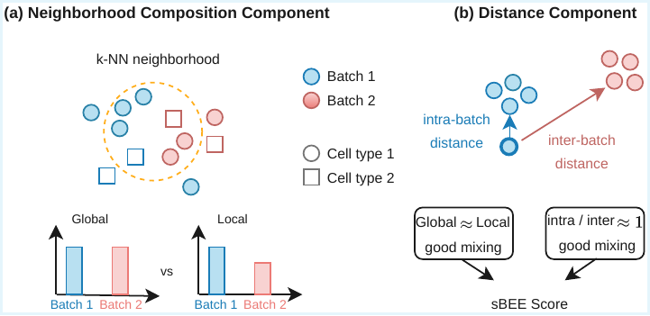
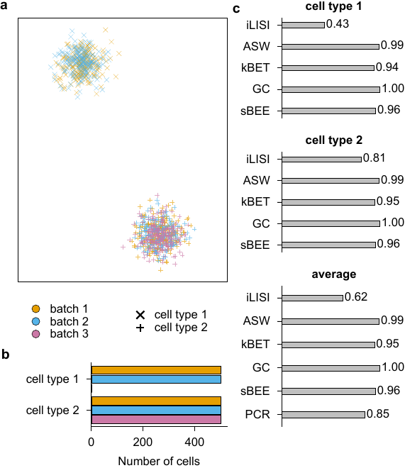

# sBEE — single-cell Batch Effect Evaluator

Single-cell RNA sequencing (scRNA-seq) datasets generated across laboratories and experimental conditions often exhibit batch effects that obscure biological variation. Numerous computational methods for batch integration have been developed, making rigorous benchmarking critical. Evaluation metrics are central to assessing method performance; however, existing metrics capture only partial aspects of integration quality and often rely on implicit assumptions about cell distributions in the embedding space. Consequently, benchmarking studies frequently report discordant rankings of batch integration methods across metrics, complicating interpretation and method selection.

Here, we systematically evaluate widely used metrics under controlled scenarios that isolate common integration challenges, including imbalanced batch composition, partial cell-type overlap, and varying cluster geometries. By stress-testing metrics under these scenarios, we identify the conditions under which each metric succeeds or fails. Based on these observations, we introduce **sBEE** (single-cell Batch Effect Evaluator), a unified metric that jointly evaluates cross-batch distance relationships and local neighborhood batch composition. Across diverse scenarios, sBEE provides stable assessments of mixing quality and remains robust to failure modes that affect existing metrics.



---

## Example scenario

The figure below shows an example scenario used to evaluate sBEE alongside existing metrics (iLISI, ASW, kBET, GC). Each scenario isolates a specific integration challenge and reports per-cell-type and average scores.



---

## Setup

### 1. Clone the repository

```bash
git clone https://github.com/tastanlab/sBEE.git
cd sBEE
```

### 2. Create the conda environment

```bash
conda env create -f environment.yml
conda activate sbee
```

### 3. Install R dependencies

Open R and run:

```r
install.packages('remotes')
remotes::install_github('theislab/kBET')
install.packages('lisi')
```

---

## Usage

```python
import os
import scanpy as sc
from integration_evaluator import IntegrationEvaluator

scenario = "data/sc_01.h5ad"
sc_dir   = "results/01"
k        = 90

os.makedirs(sc_dir, exist_ok=True)

adata = sc.read_h5ad(scenario)

evaluator = IntegrationEvaluator(
    adata,
    label_key="cell_type",
    batch_key="batch",
    sc_dir=sc_dir,
    k=k,
)

evaluator.prepare().run().save(tag=f"count_k_{k}")
```

Results are saved as CSV files under `sc_dir`:

- `scores_per_celltype_count_k_{k}.csv` — mean scores per cell type
- `scores_per_celltype_micro_macro_count_k_{k}.csv` — micro/macro averaged scores

---

## Data

Simulated scenarios can be accessed from here: https://doi.org/10.6084/m9.figshare.31766107

---

## Citation

If you use sBEE in your work, please cite:

> *Coming soon*
